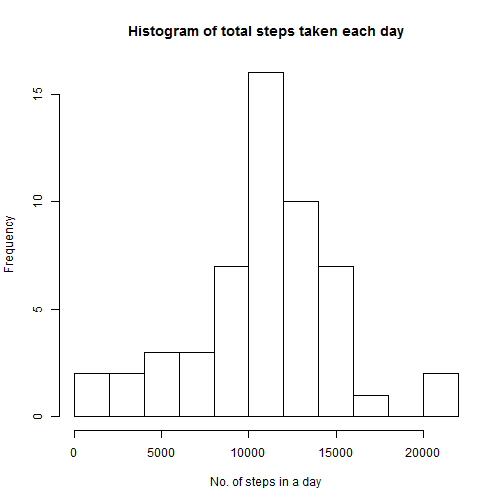
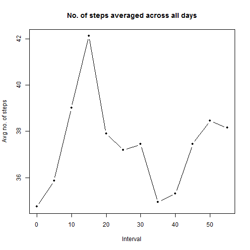
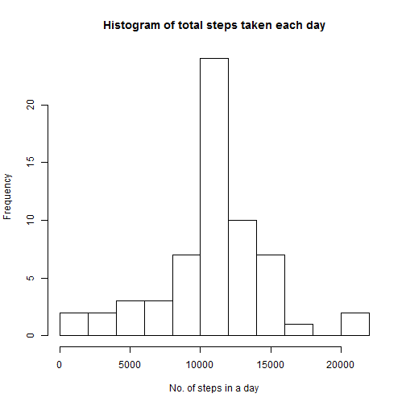
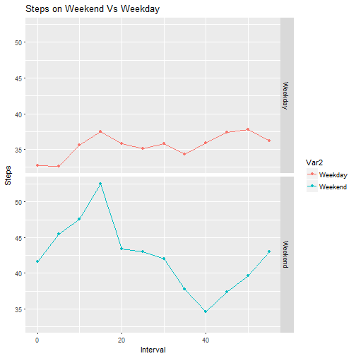

#Personal Activity Monitoring
##Analysis by Prasun Jha

###Reading the data and pre-processing
- The first step is to read in the data, convert the datetime in an R readable format and to obtain a uniform 5 minute interval across days.
- It has been assumed that the dataset is in the working directory.


```r
setwd("E:/academics/JHU - Data Science/data/rep_res1")
activity <- read.csv("activity.csv")
activity$datetime <- strptime(paste(activity$date,sprintf("%04d",activity$interval)),format = "%Y-%m-%d %H%M")
activity$interval1 <- substr(sprintf("%04d",activity$interval),3,4)
str(activity)
```

```
## 'data.frame':	17568 obs. of  5 variables:
##  $ steps    : int  NA NA NA NA NA NA NA NA NA NA ...
##  $ date     : Factor w/ 61 levels "2012-10-01","2012-10-02",..: 1 1 1 1 1 1 1 1 1 1 ...
##  $ interval : int  0 5 10 15 20 25 30 35 40 45 ...
##  $ datetime : POSIXlt, format: "2012-10-01 00:00:00" "2012-10-01 00:05:00" ...
##  $ interval1: chr  "00" "05" "10" "15" ...
```

###Steps taken per day
- The code and the histogram below are for the steps taken each day

```r
hist(tapply(activity$steps,activity$date,sum),xlab="No. of steps in a day",breaks=10,main = "Histogram of total steps taken each day")
```



- The following code snippet is to obtain the daily mean and median of the number of steps taken.

```r
daily_activity <- tapply(activity$steps,as.Date(activity$datetime),sum,na.exclude=TRUE)
daily_mean <- mean(daily_activity,na.rm=T)
daily_median <- median(daily_activity,na.rm=T)
```
The mean is 1.0767189 &times; 10<sup>4</sup> and the median is 10766

###Average daily activity pattern
- The 5 minute intervals can be identified in our analytic dataset with the column "interval1".
- The below code obtains a time series of the avg no of steps taken w.r.t. the intervals averaged across all days

```r
plot(unique(activity$interval1),tapply(activity$steps,as.numeric(activity$interval1),mean,na.rm=T),pch=20,type='b',xlab="Interval",ylab = "Avg no. of steps", main = "No. of steps averaged across all days")
```



It is clear from the plot that the **4th** 5-minute interval contains the maximum no. of steps

###Missing Values
- Let us first look at the number and ratio of the missing values

```r
num_NA <- length(which(is.na(activity$steps)))
ratio_NA <- 100*length(which(is.na(activity$steps)))/length(activity$steps)
```
There are a total of **2304** missing values which correspond to a percentage of **13.1147541** of the total observations

- The missing values are being replaced in a new dataset with the overall average number of steps a person takes in a 5-minnute interval. The number is then converted into an integer since a decimal value for the number of steps does not make any sense.

```r
activity1 <- activity
activity1$steps[is.na(activity1$steps)] <- mean(activity1$steps,na.rm=TRUE)
activity1$steps <- round(activity1$steps)
```
- Creating a histogram of total steps taken everyday

```r
hist(tapply(activity1$steps,activity1$date,sum),xlab="No. of steps in a day",breaks=10,main = "Histogram of total steps taken each day")
```



```r
new_activity <- tapply(activity1$steps,as.Date(activity1$datetime),sum)
new_mean <- mean(new_activity)
new_median <- median(new_activity)
new_median <- round(new_median)
```
 Old mean: 1.0767189 &times; 10<sup>4</sup>  
 New mean: **1.0751738 &times; 10<sup>4</sup>**  
 Old median: 10766  
 New median: **1.0656 &times; 10<sup>4</sup>**   
 As can be seen from the data, imputing NAs with the 5-minute interval average does not result in a large change from the original data. 
 
###Activity patterns between Weekdays and Weekends
- The first step is to create a factor with two levels: Weekday and Weekend. A for loop has been used to obtain the required levels in the following code
- Once the days have been divided into Weekend and Weekday, the average number of steps are calculated for different 5 minute time intervals, averaged across all weekdays and weekend. Following which the data is plotted using ggplot2
 
 ```r
 for (i in 1:length(activity1$datetime)) {activity1$weekday[i] <- if (weekdays(activity1$datetime[i]) %in% c("Saturday","Sunday")) {("Weekend")} else {("Weekday")}}
 a <-tapply(activity1$steps, list(activity1$interval1,activity1$weekday), mean)  
 library(ggplot2)    
 library(reshape2) 
 melt_a<- melt(a,id='Weekday')   
 g <- ggplot(melt_a,aes(Var1,value,color=Var2))  
 g + geom_point() + geom_line() + facet_grid(Var2~.) + labs(x="Interval") + labs(y = "Steps") + labs(title='Steps on Weekend Vs Weekday')   
 ```
 
 
